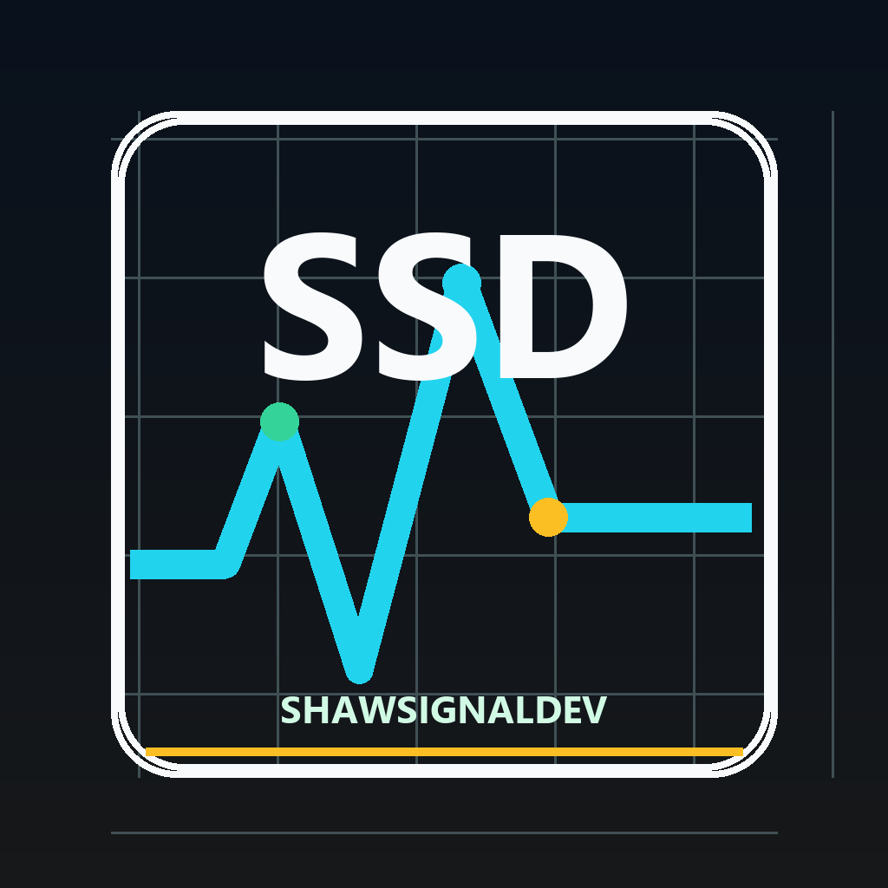
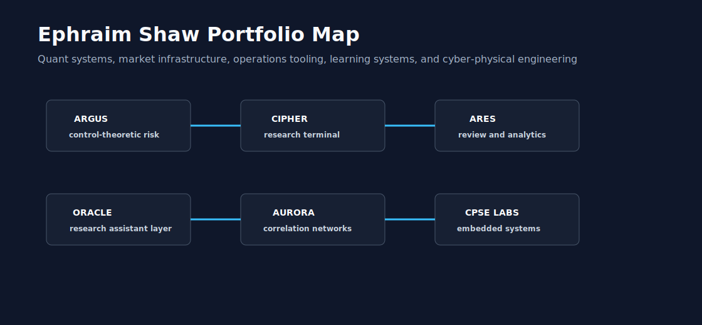
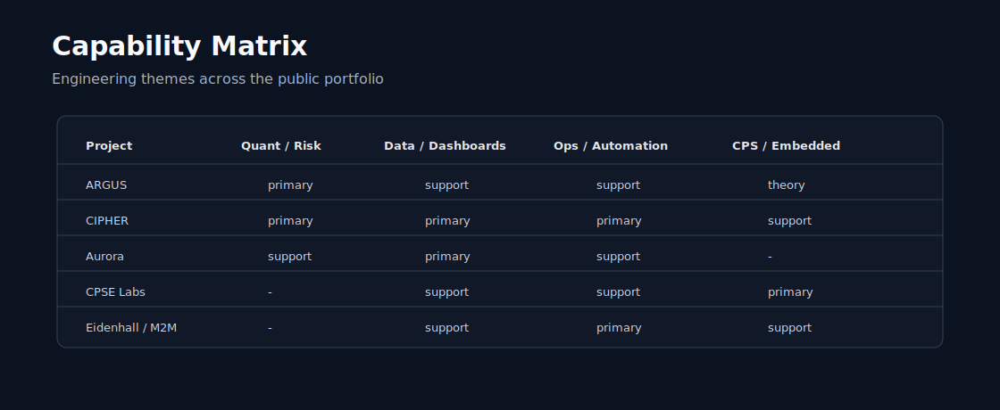

# Ephraim Shaw

**Cyber-Physical Systems Engineering | Quant Systems | Market Infrastructure | Operator Tooling**

Cyber-Physical Systems Engineering student building trading systems, decision workflows, and risk-first market infrastructure.

I build software at the intersection of quantitative finance, market data, systems automation, and cyber-physical systems. My work focuses on risk-first trading infrastructure, operator workflows, dashboards, data pipelines, and tools that make complex systems observable, testable, and operational.

I am interested in quantitative trading, software engineering, fintech infrastructure, and cyber-physical systems roles where rigorous tooling, clean documentation, and fast learning matter.

Portfolio site: [shawsignaldev.github.io](https://shawsignaldev.github.io)  
Recruiter guide: [RECRUITER_PACKET.md](RECRUITER_PACKET.md)

Public engineering handle: **ShawSignalDev**. The portfolio is organized around signal, systems, and disciplined developer workflows: data comes in, uncertainty gets modeled, operators get a clear review surface, and sensitive inputs stay out of public code.

## Current Focus

- Quantitative trading systems
- FPGA/RTL market infrastructure and hardware-oriented verification
- Research automation and operator workflow tooling
- Market-data analytics and risk infrastructure
- Cyber-physical systems engineering
- Clean Python tooling, dashboards, and technical documentation

## Research Papers

| Paper | What It Proves | Best Role Signal |
| --- | --- | --- |
| [Market Data Infrastructure Whitepaper](papers/market-data-infrastructure-whitepaper.md) | Low-latency market data architecture, event contracts, validation layers, replay, and honest operating boundaries | Market infrastructure, data engineering, FPGA systems |
| [Strategy Robustness Whitepaper](papers/strategy-robustness-whitepaper.md) | Walk-forward validation, objective functions, promotion gates, options assumptions, and research governance | Quant developer, AI research tooling, fintech infrastructure |
| [FPGA Trading Architecture Whitepaper](papers/fpga-trading-architecture-whitepaper.md) | Hardware/software trading datapath, parser and sequencer boundaries, golden models, risk gates, and verification strategy | Hardware engineering, CPSE, low-latency systems |

The [Research Reading Map](RESEARCH_READING_MAP.md) ties these papers and repositories to primary literature including DeepLOB, ABIDES, LOBFrame, FPGA HFT acceleration, and Precision Time Protocol security work.

## Role Packets

[ROLE_PACKETS.md](ROLE_PACKETS.md) gives direct review paths for Hardware / FPGA Engineer, Quant Developer, Market Infrastructure Engineer, Cyber-Physical Systems Engineer, and AI / Software Engineer roles.

## Evidence Ledger

[PORTFOLIO_EVIDENCE_LEDGER.md](PORTFOLIO_EVIDENCE_LEDGER.md) maps capability claims to public proof artifacts, validation method, and honest boundary so reviewers can distinguish implemented evidence from roadmap ambition.

## Flagship Systems Map

[FLAGSHIP_SYSTEMS_MAP.md](FLAGSHIP_SYSTEMS_MAP.md) groups the portfolio into five flagship research programs: low-latency market data and FPGA trading datapath, limit order book intelligence and market simulation, options microstructure and 0DTE research, AI-governed quant research, and cyber-physical timing/control systems.

## Advanced Research Build Queue

[ADVANCED_RESEARCH_BUILD_QUEUE.md](ADVANCED_RESEARCH_BUILD_QUEUE.md) defines the next paper-anchored repository waves, promotion criteria, role signal, and proof required before a project is added to the flagship systems.

## Reproducibility Guide

[REPRODUCIBILITY_GUIDE.md](REPRODUCIBILITY_GUIDE.md) gives exact profile verification, site verification, representative repository verification, GitHub Actions, live readback, and repo-count commands.

## Featured Projects

| Project | Focus | Status |
| --- | --- | --- |
| [Shaw Latency Research Lab](https://github.com/shawsignaldev/shaw-latency-research-lab) | Advanced latency-budget and bottleneck-analysis capstone with technical note, design decisions, tests, and recruiter brief | Capstone research lab |
| [Market Microstructure Research Platform](https://github.com/shawsignaldev/market-microstructure-research-platform) | LOB imbalance, depth, and pressure feature platform grounded in microstructure forecasting literature | Capstone quant research |
| [FPGA Trading System SoC](https://github.com/shawsignaldev/fpga-trading-system-soc) | Hardware/software trading-system datapath model connecting packet intake, risk gating, and order-intent boundaries | Capstone FPGA systems |
| [ITCH To Risk Full Pipeline](https://github.com/shawsignaldev/itch-to-risk-full-pipeline) | FPGA-oriented public-safe end-to-end parse, book update, risk approval, and replay trace flow for market-data and risk-gate review | End-to-end hardware/software pipeline |
| [AI Quant Research OS](https://github.com/shawsignaldev/ai-quant-research-os) | Approval-gated agentic quant research workflow with candidate scoring, evidence gates, and auditable Markdown queues | Capstone AI/quant system |
| [Hardware Software Co-Design Lab](https://github.com/shawsignaldev/hardware-software-co-design-lab) | Python/fixed-point algorithm comparison lab for finance and CPSE co-design with explicit error measurement | Capstone co-design lab |
| [DeepLOB Reproduction Lab](https://github.com/shawsignaldev/deeplob-reproduction-lab) | DeepLOB-style limit-order-book tensorization, mid-price movement labels, reproduction notes, tests, and CI | Paper reproduction |
| [DeepLOB Leakage Test Harness](https://github.com/shawsignaldev/deeplob-leakage-test-harness) | DeepLOB-style benchmark-hygiene harness with public-safe synthetic LOB fixtures, tensor shape checks, chronological split, label horizon audit, lookahead leakage detection, baseline metrics, and Markdown reports | Quant ML hygiene |
| [HLOB Depth Persistence Study](https://github.com/shawsignaldev/hlob-depth-persistence-study) | HLOB-style deep-level persistence study with public-safe synthetic depth fixtures, persistence features, shallow-versus-deep ablation report, horizon scores, and explicit limitations | Quant depth research |
| [LOBench Representation Lab](https://github.com/shawsignaldev/lobench-representation-lab) | LOBench-style representation transferability lab with public-safe synthetic symbol split checks, representation family comparisons, downstream tasks, leakage-aware train/test boundaries, transfer matrix scoring, and Markdown reports | Quant ML representation research |
| [LOB-Bench Generative Evaluator](https://github.com/shawsignaldev/lob-bench-generative-evaluator) | LOB-Bench-style realism metrics for public-safe synthetic message-by-order data, including event mix, interarrival, order lifetime, queue churn, price impact, invariant checks, generator ranking, and Markdown reports | Generative market data research |
| [HLOB Feature Research](https://github.com/shawsignaldev/hlob-feature-research) | Hierarchical limit-order-book feature extraction, persistence scoring, paper note, tests, and CI | Paper reproduction |
| [Optimal Execution RL Lab](https://github.com/shawsignaldev/optimal-execution-rl-lab) | Reinforcement-learning inspired execution environment, allocation policy, reward modeling, docs, and tests | Paper reproduction |
| [FPGA Feed Handler Paper Reproduction](https://github.com/shawsignaldev/fpga-feed-handler-paper-reproduction) | Packet parsing, sequence telemetry, RTL boundary framing, reproduction plan, and CI-backed tests | Paper reproduction |
| [ITCH To Risk Full Pipeline](https://github.com/shawsignaldev/itch-to-risk-full-pipeline) | FPGA-oriented public-safe end-to-end parse, book update, risk approval, and replay trace flow from ITCH-like events to order-book state and risk-gate decisions | End-to-end hardware/software pipeline |
| [PCIe DMA Descriptor Verification](https://github.com/shawsignaldev/pcie-dma-descriptor-verification) | FPGA and DMA public-safe descriptor validity, wraparound, burst sizing, and completion accounting verifier for hardware data-movement review | Hardware DMA verification |
| [PTP Hardware Timestamping Reproduction](https://github.com/shawsignaldev/ptp-hardware-timestamping-reproduction) | IEEE 1588/PTP offset and delay model with timestamping reproduction plan, docs, and tests | Paper reproduction |
| [PTP Fault Injection Core](https://github.com/shawsignaldev/ptp-fault-injection-core) | Precision Time Protocol public-safe Offset attack, Drift injection, Recovery, and Operator alert scenarios for cyber-physical timing resilience | CPSE timing resilience |
| [LOBIN-Style In-Network Inference](https://github.com/shawsignaldev/lobin-style-in-network-inference) | SmartNIC/P4-style public-safe fixed-point order-book feature scoring with latency/accuracy tradeoff reporting; not a production trading system | Hardware AI acceleration |
| [Quantized LOB Inference FPGA](https://github.com/shawsignaldev/quantized-lob-inference-fpga) | DeepLOB and LOBIN anchored public-safe fixed-point LOB inference with error bounds and throughput estimate; not a production trading system | FPGA ML inference |
| [HBM LOB Layout Benchmark](https://github.com/shawsignaldev/hbm-lob-layout-benchmark) | LOBFrame anchored public-safe HBM storage-layout report with bank conflict, row locality, and throughput evidence; not a production trading system | Memory systems |
| [Systolic LOB Feature Engine](https://github.com/shawsignaldev/systolic-lob-feature-engine) | DeepLOB anchored public-safe matrix/vector feature projection with cycle estimate and limitations; not a production trading system | Hardware acceleration |
| [ABIDES Market Simulation Lab](https://github.com/shawsignaldev/abides-market-sim-lab) | Discrete-event market simulation kernel with exchange sequencing, latency-aware ordering, and matching tests | Advanced market simulation |
| [ABIDES Agent Strategy Zoo](https://github.com/shawsignaldev/abides-agent-strategy-zoo) | ABIDES-style public-safe deterministic event simulation for market maker, momentum, noise, informed, and latency-arbitrage agents with agent PnL, inventory risk, fill counts, latency, and Markdown reports | Agent-based market simulation |
| [ABIDES Latency Impact Study](https://github.com/shawsignaldev/abides-latency-impact-study) | ABIDES-style market infrastructure study with public-safe pairwise latency matrix, latency advantage, fill rate, opportunity loss, slippage, and execution-quality report | Market infrastructure research |
| [Market Impact Validation Suite](https://github.com/shawsignaldev/market-impact-validation-suite) | ABIDES and LOBFrame anchored public-safe execution research suite with temporary impact, permanent impact, implementation shortfall, decay half-life, child-order scoring, and limitations reporting | Execution impact research |
| [Market Sim Scenario Library](https://github.com/shawsignaldev/market-sim-scenario-library) | Deterministic ABIDES-style stress, halt, auction, latency, and liquidity-drought scenario fixtures with seeds, event traces, latency matrices, CSV export, and Markdown reports | Market simulation fixtures |
| [LOBFrame Metric Dashboard](https://github.com/shawsignaldev/lobframe-metric-dashboard) | LOBFrame-style operational forecast dashboard with accuracy, macro F1, Brier score, calibration, turnover, cost-adjusted PnL, latency pass rate, explicit gates, and Markdown reports | Quant forecast metrics |
| [LOBFrame Benchmark Suite](https://github.com/shawsignaldev/lobframe-benchmark-suite) | Operational benchmark metrics for actionable limit-order-book forecasts beyond plain classification accuracy | Advanced quant benchmark |
| [LOB Benchmark Report Generator](https://github.com/shawsignaldev/lob-benchmark-report-generator) | DeepLOB/LOBFrame-style benchmark reports with cost-adjusted PnL, Brier calibration, expected value, max drawdown, latency pass rates, turnover, and Markdown reports | Quant research reporting |
| [Option Vol Surface Lab](https://github.com/shawsignaldev/option-vol-surface-lab) | Implied-volatility solver, surface points, skew diagnostics, and tested Black-Scholes utilities | Options research |
| [Gamma Exposure Estimator](https://github.com/shawsignaldev/gamma-exposure-estimator) | Dealer gamma exposure by strike, signed exposure aggregation, and gamma-flip detection | Options microstructure |
| [SmartNIC Packet Classifier](https://github.com/shawsignaldev/smartnic-packet-classifier) | Priority packet-rule classifier with drop/forward/mirror decisions and latency telemetry | SmartNIC systems |
| [SymbiYosys Formal Risk Gates](https://github.com/shawsignaldev/symbiyosys-formal-risk-gates) | Formal-methods oriented pre-trade risk model with kill-switch and exposure invariants | Formal verification |
| [HLS vs RTL Latency Lab](https://github.com/shawsignaldev/hls-vs-rtl-latency-lab) | HLS-versus-RTL cycle/resource comparison model for market-data kernel tradeoff review | FPGA methodology |
| [Paper To Code Research Agent](https://github.com/shawsignaldev/paper-to-code-research-agent) | Agentic paper-to-code planner with evidence gates for supported and unsupported research claims | Agentic research |
| [Market Impact Propagator Lab](https://github.com/shawsignaldev/market-impact-propagator-lab) | Transient impact decay, participation-rate cost modeling, and implementation shortfall attribution | Execution research |
| [Neural LOB Transformer Lab](https://github.com/shawsignaldev/neural-lob-transformer-lab) | Transformer-style causal attention for limit-order-book sequence modeling and leakage-safe event review | Deep market modeling |
| [Graph LOB GNN Lab](https://github.com/shawsignaldev/graph-lob-gnn-lab) | Graph message passing over order-book levels with pressure scoring across bid/ask node states | Graph market modeling |
| [Neural Hedging Risk Lab](https://github.com/shawsignaldev/neural-hedging-risk-lab) | Deep-hedging inspired transaction-cost accounting, terminal PnL, and CVaR-style tail risk | Options risk research |
| [Volatility Regime HMM Lab](https://github.com/shawsignaldev/volatility-regime-hmm-lab) | Hidden-Markov regime classifier with Gaussian emissions and Viterbi path decoding | Regime modeling |
| [Kalman Market State Space Lab](https://github.com/shawsignaldev/kalman-market-state-space-lab) | Kalman filtering for latent fair-value estimation from noisy market observations | State-space modeling |
| [Cointegration Stat Arb Lab](https://github.com/shawsignaldev/cointegration-stat-arb-lab) | Hedge-ratio estimation, spread z-scores, and threshold pair-trading signals | Statistical arbitrage |
| [Convex Portfolio Optimizer Lab](https://github.com/shawsignaldev/convex-portfolio-optimizer-lab) | Long-only projection, mean-variance utility, and small-portfolio allocation search | Portfolio optimization |
| [P4 Market Data Router Lab](https://github.com/shawsignaldev/p4-market-data-router-lab) | P4-style match-action routing model for venue/channel market-data packet decisions | Programmable networking |
| [RISC-V Vector Market Accelerator](https://github.com/shawsignaldev/riscv-vector-market-accelerator) | RISC-V vector cycle estimates, speedup modeling, and streaming kernel utilities | Vector acceleration |
| [TinyML Industrial Anomaly Lab](https://github.com/shawsignaldev/tinyml-industrial-anomaly-lab) | Quantized edge features and drift-aware sensor anomaly detection for CPSE monitoring | TinyML / CPSE |
| [Causal Event Study Lab](https://github.com/shawsignaldev/causal-event-study-lab) | Abnormal-return windows, cumulative treatment effects, and causal event-study scaffolding | Causal finance |
| [Differentiable Backtester Lab](https://github.com/shawsignaldev/differentiable-backtester-lab) | Smooth strategy positions, transaction-cost PnL, and finite-difference parameter gradients | Differentiable research |
| [Bayesian Strategy Optimizer](https://github.com/shawsignaldev/bayesian-strategy-optimizer) | Surrogate scoring, uncertainty estimates, and acquisition-based parameter search | Strategy optimization |
| [Contextual Bandit Trading Lab](https://github.com/shawsignaldev/contextual-bandit-trading-lab) | Online action selection with contextual scores and reward-weight updates | Online learning |
| [Rough Volatility Simulator](https://github.com/shawsignaldev/rough-volatility-simulator) | Power-law memory weights, positive variance paths, and volatility term-structure summaries | Options volatility |
| [Avellaneda Stoikov Market Making Lab](https://github.com/shawsignaldev/avellaneda-stoikov-mm-lab) | Inventory-aware reservation prices, optimal spreads, and bid/ask quote generation | Market making |
| [Portfolio Stress VaR Lab](https://github.com/shawsignaldev/portfolio-stress-var-lab) | Historical VaR, expected shortfall, and scenario stress PnL aggregation | Risk management |
| [Distributed Orderbook Consensus Lab](https://github.com/shawsignaldev/distributed-orderbook-consensus-lab) | Replicated command logs, majority commits, gap detection, and deterministic replay | Distributed systems |
| [Zero Trust Trading Audit Lab](https://github.com/shawsignaldev/zero-trust-trading-audit-lab) | Hash-chain audit events, approval gates, and tamper detection for trading operations | Security / audit |
| [Time Sync Attack Simulator](https://github.com/shawsignaldev/time-sync-attack-simulator) | PTP-like offset injection, drift detection, and timing-security alert classification | Timing security |
| [PTP Fault Injection Core](https://github.com/shawsignaldev/ptp-fault-injection-core) | Precision Time Protocol public-safe Offset attack, Drift injection, Recovery, and Operator alert scenarios for cyber-physical timing resilience | CPSE timing resilience |
| [Hawkes Order Flow Lab](https://github.com/shawsignaldev/hawkes-order-flow-lab) | Self-exciting order-flow intensity, exponential decay kernels, and burst-risk scoring | Stochastic processes |
| [Copula Tail Risk Lab](https://github.com/shawsignaldev/copula-tail-risk-lab) | Tail dependence, pseudo-observations, and joint stress-frequency utilities | Tail risk |
| [Optimal Transport Portfolio Lab](https://github.com/shawsignaldev/optimal-transport-portfolio-lab) | Allocation transport cost, long-only normalization, and rebalance mass planning | Optimal transport |
| [Jump Diffusion Options Lab](https://github.com/shawsignaldev/jump-diffusion-options-lab) | Event-risk jump counts, jump-diffusion price steps, and volatility premium estimates | Options event risk |
| [Liquidity Fragility Stress Lab](https://github.com/shawsignaldev/liquidity-fragility-stress-lab) | Depth depletion, resilience, and spread/depth fragility scoring for stressed books | Liquidity stress |
| [FPGA AXI Stream Verifier](https://github.com/shawsignaldev/fpga-axi-stream-verifier) | AXI-stream handshake counts, packet boundary checks, and backpressure measurement | FPGA verification |
| [AXI Stream Backpressure Lab](https://github.com/shawsignaldev/axi-stream-backpressure-lab) | FPGA public-safe ready/valid stall coverage, skid buffer stress, packet-boundary recovery, and no-loss packet tests | FPGA streaming verification |
| [FPGA Orderflow Formal Properties](https://github.com/shawsignaldev/fpga-orderflow-formal-properties) | SVA-style order-flow properties for sequence monotonicity, replay prevention, exposure caps, halt latch behavior, valid side encoding, bounded acknowledgement latency, and coverage matrix review | FPGA formal verification |
| [FPGA CDC Metastability Lab](https://github.com/shawsignaldev/fpga-cdc-metastability-lab) | Clock-domain crossing policy checks, synchronizer MTBF estimates, and risk levels | FPGA CDC |
| [PTP Servo Controller Lab](https://github.com/shawsignaldev/ptp-servo-controller-lab) | Clock-servo PI correction, clamp logic, and offset convergence checks | Timing control |
| [LOBIN-Style In-Network Inference](https://github.com/shawsignaldev/lobin-style-in-network-inference) | SmartNIC/P4-style public-safe fixed-point order-book feature scoring with latency/accuracy tradeoff reporting; not a production trading system | Hardware AI acceleration |
| [Quantized LOB Inference FPGA](https://github.com/shawsignaldev/quantized-lob-inference-fpga) | DeepLOB and LOBIN anchored public-safe fixed-point LOB inference with error bounds and throughput estimate; not a production trading system | FPGA ML inference |
| [HBM LOB Layout Benchmark](https://github.com/shawsignaldev/hbm-lob-layout-benchmark) | LOBFrame anchored public-safe HBM storage-layout report with bank conflict, row locality, and throughput evidence; not a production trading system | Memory systems |
| [Systolic LOB Feature Engine](https://github.com/shawsignaldev/systolic-lob-feature-engine) | DeepLOB anchored public-safe matrix/vector feature projection with cycle estimate and limitations; not a production trading system | Hardware acceleration |
| [eBPF Market Telemetry Lab](https://github.com/shawsignaldev/ebpf-market-telemetry-lab) | Per-flow latency, drop-rate summaries, and market-data health verdicts | Observability |
| [WASM Strategy Sandbox](https://github.com/shawsignaldev/wasm-strategy-sandbox) | Capability policy checks, instruction budgets, and deterministic strategy-module allow/reject decisions | Secure sandboxing |
| [Kernel Bypass Feed Latency Lab](https://github.com/shawsignaldev/kernel-bypass-feed-latency-lab) | Kernel-vs-bypass latency composition, speedup estimates, and bottleneck detection | Low-latency systems |
| [Auction Imbalance Alpha Lab](https://github.com/shawsignaldev/auction-imbalance-alpha-lab) | Opening/closing auction imbalance ratios, indicative price distance, and pressure labels | Auction microstructure |
| [Adaptive Order Slicing Lab](https://github.com/shawsignaldev/adaptive-order-slicing-lab) | TWAP, VWAP, and urgency-adjusted execution schedules with quantity preservation | Execution algorithms |
| [Synthetic Market Data Generator](https://github.com/shawsignaldev/synthetic-market-data-generator) | Deterministic OHLCV and quote fixtures for safe tests and public demos | Synthetic data |
| [Causal Graph Market Lab](https://github.com/shawsignaldev/causal-graph-market-lab) | DAG assumptions, descendant traversal, intervention targets, and cycle detection | Causal research |
| [Explainable Alpha Attribution Lab](https://github.com/shawsignaldev/explainable-alpha-attribution-lab) | Normalized feature contributions, top-driver extraction, and signal explanations | Explainable AI |
| [Trade Surveillance Rules Lab](https://github.com/shawsignaldev/trade-surveillance-rules-lab) | Cancel ratios, layering scores, and surveillance severity classification | Compliance monitoring |
| [FPGA FIFO Depth Planner](https://github.com/shawsignaldev/fpga-fifo-depth-planner) | Burst-depth sizing, overflow simulation, and FIFO headroom metrics | FPGA capacity |
| [Hardware Cache Coherence Lab](https://github.com/shawsignaldev/hardware-cache-coherence-lab) | MESI-style state transitions, invalidation handling, and event replay | Computer architecture |
| [Market Data Schema Contracts](https://github.com/shawsignaldev/market-data-schema-contracts) | Required-field checks, type validation, sequence gaps, and data-contract verdicts | Data quality |
| [Shared Market Packet Fixtures](https://github.com/shawsignaldev/shared-market-packet-fixtures) | Canonical packet contract, CSV round trip, sequence-gap detection, deterministic fingerprints, and top-of-book projection for FPGA/replay/simulation tests | Market data fixtures |
| [Incident Response Runbook Engine](https://github.com/shawsignaldev/incident-response-runbook-engine) | Severity escalation, next-step selection, and incident runbook state summaries | Operations |
| [Cross Venue Latency Arbitrage Lab](https://github.com/shawsignaldev/cross-venue-latency-arbitrage-lab) | Latency-adjusted venue quotes, fee-adjusted edges, and cross-venue opportunity ranking | Venue microstructure |
| [Options Market Maker Greeks Lab](https://github.com/shawsignaldev/options-market-maker-greeks-lab) | Delta/gamma/vega aggregation, delta hedge sizing, and risk bucket classification | Options market making |
| [Volatility Surface Arbitrage Detector](https://github.com/shawsignaldev/volatility-surface-arbitrage-detector) | Calendar monotonicity, convexity proxy checks, and surface violation reports | Volatility surface QC |
| [Market Data Reconciliation Engine](https://github.com/shawsignaldev/market-data-reconciliation-engine) | Provider mismatch detection, tolerance-based price checks, and reconciliation verdicts | Data operations |
| [Deterministic Replay Debugger](https://github.com/shawsignaldev/deterministic-replay-debugger) | Event replay, state traces, and first-divergence debugging for deterministic systems | Replay debugging |
| [PCIe Descriptor Ring Simulator](https://github.com/shawsignaldev/pcie-descriptor-ring-simulator) | DMA descriptor ring occupancy, wraparound pointers, and push-capacity checks | PCIe/DMA systems |
| [FPGA Packet Checksum Offload](https://github.com/shawsignaldev/fpga-packet-checksum-offload) | One's-complement checksum, validation, and offload metadata for packet datapaths | FPGA packet processing |
| [Feature Store Point In Time Lab](https://github.com/shawsignaldev/feature-store-point-in-time-lab) | As-of feature lookup, timestamped records, and leakage detection for quant ML | Feature stores |
| [Model Risk Validation Lab](https://github.com/shawsignaldev/model-risk-validation-lab) | Metric threshold checks, documentation completeness, and approval verdict generation | Model risk |
| [Research Lineage Ledger](https://github.com/shawsignaldev/research-lineage-ledger) | Experiment fingerprints, missing evidence checks, and parent-child lineage depth | Research governance |
| [Tick Data Lakehouse Simulator](https://github.com/shawsignaldev/tick-data-lakehouse-simulator) | Tick partitioning, compacted manifest rows, VWAP, volume, and audit metadata | Data engineering |
| [Event Sourced Market Feed Pipeline](https://github.com/shawsignaldev/event-sourced-market-feed-pipeline) | Sequence-aware feed replay, gap detection, and top-of-book projection | Event sourcing |
| [Backtest Result Warehouse](https://github.com/shawsignaldev/backtest-result-warehouse) | Strategy-result scoring, symbol summaries, and ranked research result storage | Backtest infrastructure |
| [Alert Event Bus Adapters](https://github.com/shawsignaldev/alert-event-bus-adapters) | Alert normalization, dedupe keys, severity routing, and Discord-style payloads | Operations alerts |
| [Reproducible Experiment Registry](https://github.com/shawsignaldev/reproducible-experiment-registry) | Stable experiment fingerprints and metric-delta comparisons | Experiment tracking |
| [Branch Predictor Lab](https://github.com/shawsignaldev/branch-predictor-lab) | Two-bit saturating branch predictor simulation and accuracy reporting | Computer architecture |
| [NoC Packet Routing Simulator](https://github.com/shawsignaldev/noc-packet-routing-simulator) | Mesh network-on-chip coordinates, XY routing paths, and congestion costs | Computer architecture |
| [Systolic Array Market Accelerator](https://github.com/shawsignaldev/systolic-array-market-accelerator) | Matrix-vector feature projection and systolic-cycle estimation | Hardware acceleration |
| [Hardware Formal Coverage Lab](https://github.com/shawsignaldev/hardware-formal-coverage-lab) | Formal-property coverage ratios and unproven safety blocker detection | Formal verification |
| [Portfolio Project Map Generator](https://github.com/shawsignaldev/portfolio-project-map-generator) | Role-based project grouping and recruiter-facing Markdown map generation | Portfolio systems |
| [Queue Position Fill Probability Lab](https://github.com/shawsignaldev/queue-position-fill-probability-lab) | Queue-position fill probability and expected-fill sizing for limit-order research | Execution microstructure |
| [Spread Impact Slippage Estimator](https://github.com/shawsignaldev/spread-impact-slippage-estimator) | Spread, market-impact, timing, and total-slippage cost decomposition | Execution quality |
| [Realistic Fill Backtester](https://github.com/shawsignaldev/realistic-fill-backtester) | Limit-order fill simulation with partial fills, participation caps, and miss handling | Backtesting realism |
| [TFT Market Forecasting Lab](https://github.com/shawsignaldev/tft-market-forecasting-lab) | Quantile-loss and gated feature-importance utilities inspired by Temporal Fusion Transformers | Forecasting research |
| [Options Liquidity Scanner](https://github.com/shawsignaldev/options-liquidity-scanner) | Contract liquidity scoring by spread, activity, and delta proximity | Options microstructure |
| [Skew Term Structure Monitor](https://github.com/shawsignaldev/skew-term-structure-monitor) | Options skew slope and term-structure inversion diagnostics | Volatility research |
| [AXI Lite Register Map Generator](https://github.com/shawsignaldev/axi-lite-register-map-generator) | Register-map validation and generated C-header defines for AXI-Lite control planes | FPGA tooling |
| [UVM Lite Verification Harness](https://github.com/shawsignaldev/uvm-lite-verification-harness) | Transaction scoreboards, mismatch detection, and operation coverage bins | Hardware verification |
| [HLS Pipeline Scheduler Lab](https://github.com/shawsignaldev/hls-pipeline-scheduler-lab) | Initiation-interval latency estimation and resource-pressure reporting | HLS planning |
| [PCIe Throughput Budget Lab](https://github.com/shawsignaldev/pcie-throughput-budget-lab) | PCIe payload efficiency and queue-depth budgeting for DMA-oriented systems | PCIe systems |
| [OPRA Options Feed Normalizer](https://github.com/shawsignaldev/opra-options-feed-normalizer) | OPRA-style option symbol parsing, quote normalization, mid, spread, and depth metrics | Options market data |
| [FIX Session Replay Analyzer](https://github.com/shawsignaldev/fix-session-replay-analyzer) | FIX sequence-gap detection and resend-request generation for session replay | Trading protocol ops |
| [Market Halt Circuit Breaker Simulator](https://github.com/shawsignaldev/market-halt-circuit-breaker-simulator) | Halt threshold modeling and market-move trigger evaluation | Market operations |
| [Risk Limit Policy DSL](https://github.com/shawsignaldev/risk-limit-policy-dsl) | Small policy DSL for notional and quantity checks on order objects | Risk policy |
| [Order Throttle Leaky Bucket Lab](https://github.com/shawsignaldev/order-throttle-leaky-bucket-lab) | Leaky-bucket order-rate throttling with leak and capacity accounting | Gateway controls |
| [Corporate Action Price Adjuster](https://github.com/shawsignaldev/corporate-action-price-adjuster) | Split and dividend adjustment utilities for historical price research | Data adjustment |
| [Factor Exposure Neutralizer](https://github.com/shawsignaldev/factor-exposure-neutralizer) | Portfolio factor exposure calculation and hedge-notional suggestions | Portfolio risk |
| [Walk Forward Regime Validator](https://github.com/shawsignaldev/walk-forward-regime-validator) | Regime-level expectancy summaries and promotion/rejection verdicts | Strategy validation |
| [RTL Lint Rule Engine](https://github.com/shawsignaldev/rtl-lint-rule-engine) | Lightweight RTL lint checks for reset references and sequential assignments | RTL quality |
| [Clock Domain Reset Sequencer Lab](https://github.com/shawsignaldev/clock-domain-reset-sequencer-lab) | Reset-release ordering and dependency validation across clock domains | FPGA reset control |
| [Earnings IV Crush Model](https://github.com/shawsignaldev/earnings-iv-crush-model) | Implied-volatility crush and post-event option value-change utilities | Options events |
| [Contract Selector Options Lab](https://github.com/shawsignaldev/contract-selector-options-lab) | Options contract filtering by expiry, delta, spread, and volume | Options selection |
| [Options PnL Attribution Engine](https://github.com/shawsignaldev/options-pnl-attribution-engine) | Delta, gamma, vega, theta, and residual PnL attribution | Options risk |
| [Kernel Bypass Ring Buffer Lab](https://github.com/shawsignaldev/kernel-bypass-ring-buffer-lab) | Single-producer/single-consumer ring-buffer accounting for packet paths | Low-latency networking |
| [Multicast Gap Recovery Engine](https://github.com/shawsignaldev/multicast-gap-recovery-engine) | Sequence-gap tracking and retransmission request generation | Market data recovery |
| [SmartNIC Flow Table Simulator](https://github.com/shawsignaldev/smartnic-flow-table-simulator) | Priority flow-rule matching and action selection for packet paths | SmartNIC systems |
| [RISC-V Orderbook Coprocessor Lab](https://github.com/shawsignaldev/riscv-orderbook-coprocessor-lab) | Instruction-level cycle estimates for order-book coprocessor primitives | RISC-V acceleration |
| [Memory Bandwidth Benchmark Suite](https://github.com/shawsignaldev/memory-bandwidth-benchmark-suite) | Bandwidth and utilization estimates for memory-bound systems | Computer architecture |
| [Thermal Aware FPGA Placement Lab](https://github.com/shawsignaldev/thermal-aware-fpga-placement-lab) | Thermal hotspot scoring and placement-cost utilities | FPGA placement |
| [Research Paper Reproduction Tracker](https://github.com/shawsignaldev/research-paper-reproduction-tracker) | Reproduction evidence scoring and completion status for research papers | Research governance |
| [Order Flow Toxicity VPIN Lab](https://github.com/shawsignaldev/order-flow-toxicity-vpin-lab) | Volume-synchronized buy/sell imbalance and VPIN order-flow toxicity estimates | Market microstructure |
| [Intraday Seasonality Curve Lab](https://github.com/shawsignaldev/intraday-seasonality-curve-lab) | Normalized volume and volatility seasonality curves by intraday slot | Intraday analytics |
| [Liquidity Heatmap Engine](https://github.com/shawsignaldev/liquidity-heatmap-engine) | Price-bucket liquidity aggregation for order-book depth heatmaps | Liquidity analytics |
| [News Event Volatility Linker](https://github.com/shawsignaldev/news-event-volatility-linker) | Event-window realized-volatility linkage for news response research | Event analytics |
| [SEC Filing XBRL Factor Lab](https://github.com/shawsignaldev/sec-filing-xbrl-factor-lab) | XBRL-style net-margin and leverage factor extraction | Fundamental data |
| [Cache Aware Orderbook Layout Lab](https://github.com/shawsignaldev/cache-aware-orderbook-layout-lab) | Cache-line footprint estimates for order-book layout decisions | Computer architecture |
| [DMA Burst Coalescer Simulator](https://github.com/shawsignaldev/dma-burst-coalescer-simulator) | DMA burst coalescing and descriptor-count estimation | Hardware data movement |
| [Hardware Timing Constraint Checker](https://github.com/shawsignaldev/hardware-timing-constraint-checker) | Setup/hold slack classification and worst-slack reporting | FPGA timing |
| [Formal Liveness Monitor Lab](https://github.com/shawsignaldev/formal-liveness-monitor-lab) | Bounded request/acknowledge liveness violation detection | Formal verification |
| [HFT Config Drift Detector](https://github.com/shawsignaldev/hft-config-drift-detector) | Deterministic configuration drift detection and severity classification | Trading operations |
| [Lockfree Order Gateway](https://github.com/shawsignaldev/lockfree-order-gateway) | Ring-buffer style order-gateway model with architecture, C++ interface, benchmark-plan docs, and docs-contract tests | Low-latency C++ systems |
| [Kernel Bypass Feed Handler Cpp](https://github.com/shawsignaldev/kernel-bypass-feed-handler-cpp) | Sequence-aware feed-handler normalization with architecture, C++ interface, benchmark-plan docs, and docs-contract tests | Low-latency feed handling |
| [Cacheline Aware Risk Engine](https://github.com/shawsignaldev/cacheline-aware-risk-engine) | Risk-limit checks with cache-line footprint estimation, C++ interface notes, benchmark plan, and docs-contract tests | Low-latency risk controls |
| [Deterministic Replay Cpp Engine](https://github.com/shawsignaldev/deterministic-replay-cpp-engine) | Deterministic replay and first-divergence detection with architecture, C++ interface, benchmark-plan docs, and docs-contract tests | Replay debugging |
| [Single Writer Ringbuffer Benchmark](https://github.com/shawsignaldev/single-writer-ringbuffer-benchmark) | Single-writer ring-buffer throughput and occupancy model with C++ interface and benchmark-plan depth docs | Low-latency benchmarking |
| [Queue Reactive Orderbook Model](https://github.com/shawsignaldev/queue-reactive-orderbook-model) | Queue-reactive fill probability with math-model, validation-protocol, limitations/regime docs, and research-doc tests | Market microstructure |
| [LOB Transformer Reproduction](https://github.com/shawsignaldev/lob-transformer-reproduction) | Transformer-inspired LOB sequence utilities with math-model, validation-protocol, limitations/regime docs, and research-doc tests | Paper reproduction |
| [Hawkes Liquidity Clustering Lab](https://github.com/shawsignaldev/hawkes-liquidity-clustering-lab) | Self-exciting liquidity-event intensity with math-model, validation-protocol, limitations/regime docs, and research-doc tests | Stochastic microstructure |
| [Cross Venue Latency Arb Simulator](https://github.com/shawsignaldev/cross-venue-latency-arb-simulator) | Latency-adjusted cross-venue ranking with math-model, validation-protocol, limitations/regime docs, and research-doc tests | Venue microstructure |
| [Auction Imbalance Predictor](https://github.com/shawsignaldev/auction-imbalance-predictor) | Auction imbalance pressure labels with math-model, validation-protocol, limitations/regime docs, and research-doc tests | Auction microstructure |
| [FPGA Transformer Attention Kernel](https://github.com/shawsignaldev/fpga-transformer-attention-kernel) | FPGA attention cycle/memory estimates with hardware-architecture, throughput/memory, verification-plan docs, and accelerator-doc tests | Hardware AI acceleration |
| [Systolic Array Backtester Accelerator](https://github.com/shawsignaldev/systolic-array-backtester-accelerator) | Systolic-array tile/utilization estimates with hardware-architecture, throughput/memory, verification-plan docs, and accelerator-doc tests | Hardware acceleration |
| [RISC-V Vector Alpha Engine](https://github.com/shawsignaldev/riscv-vector-alpha-engine) | RISC-V vector-lane alpha estimates with hardware-architecture, throughput/memory, verification-plan docs, and accelerator-doc tests | Vector acceleration |
| [HBM Orderbook Layout Simulator](https://github.com/shawsignaldev/hbm-orderbook-layout-simulator) | HBM bank-mapping and imbalance estimates with hardware-architecture, throughput/memory, verification-plan docs, and accelerator-doc tests | Memory systems |
| [Quantized ML FPGA Inference Lab](https://github.com/shawsignaldev/quantized-ml-fpga-inference-lab) | Quantized FPGA inference utilities with hardware-architecture, throughput/memory, verification-plan docs, and accelerator-doc tests | FPGA ML inference |
| [NASDAQ ITCH Parser RTL Lab](https://github.com/shawsignaldev/nasdaq-itch-parser-rtl-lab) | ITCH parser model with system design, validation evidence, operating boundaries, and milestone documentation tests | Market data hardware |
| [FIX FAST Decoder Benchmark](https://github.com/shawsignaldev/fix-fast-decoder-benchmark) | FIX/FAST decode benchmark with system design, validation evidence, operating boundaries, and milestone documentation tests | Protocol benchmarking |
| [Multicast Feed Arbitration FPGA](https://github.com/shawsignaldev/multicast-feed-arbitration-fpga) | A/B feed arbitration with system design, validation evidence, operating boundaries, and milestone documentation tests | FPGA feed reliability |
| [PTP Nanosecond Timestamp Core](https://github.com/shawsignaldev/ptp-nanosecond-timestamp-core) | PTP timestamp math with system design, validation evidence, operating boundaries, and milestone documentation tests | Hardware timestamping |
| [Market Data Tickerplant Simulator](https://github.com/shawsignaldev/market-data-tickerplant-simulator) | Tickerplant top-of-book projection with system design, validation evidence, operating boundaries, and milestone documentation tests | Market data systems |
| [Market Sim Scenario Library](https://github.com/shawsignaldev/market-sim-scenario-library) | ABIDES-style stress, halt, auction, latency, and liquidity-drought fixtures with deterministic seeds, event traces, latency matrices, CSV export, and Markdown reports | Market simulation fixtures |
| [Zero DTE Options Backtester](https://github.com/shawsignaldev/zero-dte-options-backtester) | Same-day options PnL model with system design, validation evidence, operating boundaries, and milestone documentation tests | Options backtesting |
| [Zero-DTE Opening Drive Study](https://github.com/shawsignaldev/zero-dte-opening-drive-study) | Strategy Robustness Whitepaper for public-safe First 5/15/45 minute windows, risk sizing, slippage, and walk-forward report evidence; not financial advice | Options strategy research |
| [Gamma/VWAP Confluence Lab](https://github.com/shawsignaldev/gamma-vwap-confluence-lab) | Strategy Robustness Whitepaper for public-safe gamma level, VWAP, volume pressure, and failed-breakout classification evidence; not financial advice and not a production trading system | Options microstructure |
| [Weekly Contract Selector Benchmark](https://github.com/shawsignaldev/weekly-contract-selector-benchmark) | Strategy Robustness Whitepaper for public-safe Same-day versus nearest-weekly comparison, liquidity filters, target-delta selection, and spread control; not financial advice and not a production trading system | Options systems |
| [Intraday IV Expansion Monitor](https://github.com/shawsignaldev/intraday-iv-expansion-monitor) | Rough volatility and IV surface notes anchored public-safe IV expansion/compression labels, volatility regime, spread control, and signal-quality report evidence; not financial advice and not a production trading system | Volatility research |
| [Open Interest Liquidity Regime Lab](https://github.com/shawsignaldev/open-interest-liquidity-regime-lab) | Strategy Robustness Whitepaper for public-safe OI, spread, volume, and contract survivability scoring with open interest growth and liquidity regime evidence; not financial advice and not a production trading system | Options data |
| [First-Hour Momentum Regime Lab](https://github.com/shawsignaldev/first-hour-momentum-regime-lab) | LOBFrame anchored public-safe Open, midday, and close regime splits with expectancy, drawdown, and volume confirmation evidence; not financial advice and not a production trading system | Quant developer |
| [Session High/Low Breakout Validator](https://github.com/shawsignaldev/session-high-low-breakout-validator) | Strategy Robustness Whitepaper for public-safe Premarket, regular session, and close-range breakout validation with close-location value, VWAP distance, and volume pressure evidence; not financial advice and not a production trading system | Trading systems |
| [Synthetic Options Chain Generator](https://github.com/shawsignaldev/synthetic-options-chain-generator) | Deterministic synthetic calls/puts with IV skew, Greeks, bid/ask spread, volume, open interest, liquidity scoring, and target-delta selection | Options research fixtures |
| [Option Replay Report Engine](https://github.com/shawsignaldev/option-replay-report-engine) | Deterministic per-contract replay reports separating contract PnL, fees, liquidity cost, theta drag, volatility contribution, reward-to-risk, quality scoring, and promotion verdicts | Options PnL attribution |
| [Dealer Gamma Feedback Lab](https://github.com/shawsignaldev/dealer-gamma-feedback-lab) | Dealer-gamma feedback model with system design, validation evidence, operating boundaries, and milestone documentation tests | Options microstructure |
| [Options Flow Anomaly Detector](https://github.com/shawsignaldev/options-flow-anomaly-detector) | Options-flow anomaly detector with system design, validation evidence, operating boundaries, and milestone documentation tests | Options flow analytics |
| [IV Surface Microstructure Lab](https://github.com/shawsignaldev/iv-surface-microstructure-lab) | IV skew/term-structure diagnostics with system design, validation evidence, operating boundaries, and milestone documentation tests | Volatility surface research |
| [Contract Routing Risk Engine](https://github.com/shawsignaldev/contract-routing-risk-engine) | Options contract routing checks with system design, validation evidence, operating boundaries, and milestone documentation tests | Options routing |
| [Agentic Strategy Search Lab](https://github.com/shawsignaldev/agentic-strategy-search-lab) | Agentic candidate scoring with system design, validation evidence, operating boundaries, and milestone documentation tests | AI quant research |
| [Research Queue State Machine](https://github.com/shawsignaldev/research-queue-state-machine) | evidence-gated AI research workflow with proposed, tested, challenged, promoted, watchlisted, and rejected states, missing-evidence checks, audit trails, and human approval gates | AI research governance |
| [Paper To Alpha Reproduction Suite](https://github.com/shawsignaldev/paper-to-alpha-reproduction-suite) | Paper reproduction evidence scoring with system design, validation evidence, operating boundaries, and milestone documentation tests | Research reproduction |
| [Walk Forward Auto Optimizer](https://github.com/shawsignaldev/walk-forward-auto-optimizer) | Walk-forward optimizer with system design, validation evidence, operating boundaries, and milestone documentation tests | Strategy optimization |
| [LLM Market Hypothesis Auditor](https://github.com/shawsignaldev/llm-market-hypothesis-auditor) | LLM hypothesis auditor with system design, validation evidence, operating boundaries, and milestone documentation tests | Research governance |
| [FPGA Low-Latency Market Data Engine](https://github.com/shawsignaldev/fpga-low-latency-market-data-engine) | Parameterized Verilog market-data pipeline with sequence integrity, top-of-book state, deterministic cycle accounting, safety gating, self-checking RTL verification, Python golden model, and toolchain-ready documentation | Hardware / low-latency systems |
| [FPGA Nanosecond Orderbook Risk Gate](https://github.com/shawsignaldev/fpga-nanosecond-orderbook-risk-gate) | Verilog orderbook safety core with add/replace/cancel state, exposure limits, sequence faults, kill switch, crossed-market halt, Python model, and self-checking RTL verification | Hardware risk gate |
| [FPGA UDP Market Data Feed Handler](https://github.com/shawsignaldev/fpga-udp-market-data-feed-handler) | UDP-style packet parser with port/session filtering, payload extraction, sequence-gap/replay telemetry, checksum metadata, Python model, and RTL simulation | Hardware networking |
| [FPGA Latency Arbitration Crossbar](https://github.com/shawsignaldev/fpga-latency-arbitration-crossbar) | Low-latency stream arbitration core with backpressure-safe buffering, round-robin routing, latency counters, Python model, and self-checking RTL testbench | Hardware data path |
| [FPGA PCIe Market Data DMA Engine](https://github.com/shawsignaldev/fpga-pcie-market-data-dma-engine) | PCIe-style market-data DMA scheduler with descriptor validation, payload burst packetization, latency accounting, Python model, and Verilog module boundary | Hardware data movement |
| [PCIe DMA Descriptor Verification](https://github.com/shawsignaldev/pcie-dma-descriptor-verification) | FPGA and DMA public-safe descriptor validity, wraparound, burst sizing, completion accounting, and Markdown report evidence for PCIe-style rings | Hardware DMA verification |
| [Shaw Alpha Lab](https://github.com/shawsignaldev/shaw-alpha-lab) | Opening-range momentum research framework with trade generation, risk/reward controls, expectancy, profit factor, and drawdown metrics | Quant research |
| [Options EV Estimator](https://github.com/shawsignaldev/options-ev-estimator) | Black-Scholes inspired options expected-value estimator for same-day and nearest-weekly contract research when full chain history is unavailable | Options research |
| [Agentic Quant Researcher](https://github.com/shawsignaldev/agentic-quant-researcher) | Deterministic strategy-candidate scoring and Markdown report generation for AI-assisted quant research workflows | AI research tooling |
| [Latency Budget Workbench](https://github.com/shawsignaldev/latency-budget-workbench) | Latency decomposition, bottleneck detection, and budget-slack reporting for market infrastructure and cyber-physical systems | Systems engineering |
| [Market Microstructure Lab](https://github.com/shawsignaldev/market-microstructure-lab) | VWAP, spread, close-location, volume-pressure, and opening-drive metrics for intraday market review | Market structure |
| [Strategy Survivorship Analyzer](https://github.com/shawsignaldev/strategy-survivorship-analyzer) | Walk-forward persistence scoring, window-level expectancy, consistency, and promote/watchlist/reject verdicts | Strategy robustness |
| [Fixed-Point Finance Lab](https://github.com/shawsignaldev/fixed-point-finance-lab) | FPGA-friendly price, basis-point, and EMA calculations using fixed-point integer math | FPGA finance math |
| [Deterministic Trading State Machine](https://github.com/shawsignaldev/deterministic-trading-state-machine) | Auditable signal, risk, entry, management, and exit transitions for trading workflow design | State-machine design |
| [Risk Gate Co-Simulation Lab](https://github.com/shawsignaldev/risk-gate-co-simulation-lab) | Python co-simulation harness connecting strategy signals to deterministic pre-trade risk approvals and rejections | Risk co-simulation |
| [Repo Context Engineer](https://github.com/shawsignaldev/repo-context-engineer) | GitHub repository scoring and Markdown context-brief generation for agentic engineering research | Context engineering |
| [Obsidian Trading Memory Sync](https://github.com/shawsignaldev/obsidian-trading-memory-sync) | Obsidian Markdown frontmatter parser and SQLite sync layer for private trading research memory | Local memory systems |
| [AI Runbook Operator](https://github.com/shawsignaldev/ai-runbook-operator) | Approval-gated runbook model with command risk classification and auditable dry-run traces | Agent operations |
| [ESP32 Market Alert Display](https://github.com/shawsignaldev/esp32-market-alert-display) | Embedded-friendly alert prioritization and fixed-width display formatting for small market-monitor screens | Embedded alerts |
| [Sensor Fusion Risk Monitor](https://github.com/shawsignaldev/sensor-fusion-risk-monitor) | CPSE anomaly scoring with per-channel baselines, fused z-scores, and operator risk summaries | Sensor fusion |
| [FPGA FIX Protocol Parser](https://github.com/shawsignaldev/fpga-fix-protocol-parser) | Hardware-oriented FIX tag-value parser with required order-field validation, normalized order intents, tests, and RTL boundary | Market connectivity |
| [FPGA LOB Reconstruction Engine](https://github.com/shawsignaldev/fpga-lob-reconstruction-engine) | Limit-order-book reconstruction model with add/modify/cancel/trade transitions, top-of-book state, and crossed-market detection | Order book hardware model |
| [FPGA Hardware Timestamping Core](https://github.com/shawsignaldev/fpga-hardware-timestamping-core) | Timestamp normalization, event ordering, skew analysis, and channel monotonicity checks for feed pipelines | Hardware timestamping |
| [Market Data Line-Rate Simulator](https://github.com/shawsignaldev/market-data-line-rate-simulator) | Burst, queue, drop, peak-depth, and utilization simulator for feed-handler capacity planning | Market data capacity |
| [Execution Router Simulator](https://github.com/shawsignaldev/execution-router-simulator) | Venue scoring by latency, fee, fill probability, and risk penalty for deterministic routing review | Execution infrastructure |
| [Cyber-Physical Threat Models](https://github.com/shawsignaldev/cyber-physical-threat-models) | Sanitized CPSE threat modeling with severity, likelihood, detectability, mitigation, residual risk, and Markdown registers | CPSE security |
| [Real-Time Scheduler Lab](https://github.com/shawsignaldev/real-time-scheduler-lab) | Periodic task utilization, rate-monotonic bounds, EDF scheduling, and deadline-miss analysis | Real-time systems |
| [UDP Telemetry Control Plane](https://github.com/shawsignaldev/udp-telemetry-control-plane) | UDP telemetry checksum, sequence, channel validation, and command authorization model | Telemetry systems |
| [Edge Device Health Monitor](https://github.com/shawsignaldev/edge-device-health-monitor) | Edge-device CPU, memory, temperature, heartbeat scoring, status classification, and operator summaries | Edge monitoring |
| [Industrial Control Sim Lab](https://github.com/shawsignaldev/industrial-control-sim-lab) | PID-like first-order process simulation and persistent tracking-error fault detection | Control simulation |
| [Financial Report Summarizer](https://github.com/shawsignaldev/financial-report-summarizer) | Deterministic revenue, margin, guidance, positive-language, and risk-language extraction for financial text review | Financial text analysis |
| [Market News Signal Ranker](https://github.com/shawsignaldev/market-news-signal-ranker) | Catalyst scoring by source quality, recency, watchlist relevance, uncertainty, and event type for research triage | News research |
| [AI Dashboard Commentary Engine](https://github.com/shawsignaldev/ai-dashboard-commentary-engine) | Metric-to-commentary generation for dashboards with direction, severity, and operator-readable summaries | Dashboard intelligence |
| [Prompt Eval Lab](https://github.com/shawsignaldev/prompt-eval-lab) | Deterministic prompt-output rubric checks, forbidden-term detection, score aggregation, and pass-rate reporting | Prompt evaluation |
| [LLM Trading Guardrails](https://github.com/shawsignaldev/llm-trading-guardrails) | Policy checks for unsafe certainty claims, approval-gate requirements, and sensitive-token redaction in trading research workflows | AI safety |
| [Distributed Clock Sync Lab](https://github.com/shawsignaldev/distributed-clock-sync-lab) | Clock offset, delay, synchronization quality, and drift analysis for timing-sensitive distributed systems | Timing systems |
| [Embedded Signal Processing Lab](https://github.com/shawsignaldev/embedded-signal-processing-lab) | Moving averages, exponential smoothing, DFT magnitudes, and threshold anomaly helpers for embedded DSP review | Embedded DSP |
| [Operator Console Design System](https://github.com/shawsignaldev/operator-console-design-system) | Severity colors, density tokens, and compact status-card labels for serious operator dashboards | Design systems |
| [Degraded Mode Operator Console](https://github.com/shawsignaldev/degraded-mode-operator-console) | CPSE degraded-mode workflow with normal, degraded, fault, operator-acknowledged, and recovery states, Precision Time Protocol context, safe mode operator cards, operator acknowledgement gates, recovery checks, audit trails, and Markdown reports | CPSE operator systems |
| [Event-Driven Alpha Pipeline](https://github.com/shawsignaldev/event-driven-alpha-pipeline) | Deterministic market-event scoring and ranked alpha signal generation for research review | Event pipelines |
| [Market Replay Hardware Harness](https://github.com/shawsignaldev/market-replay-hardware-harness) | Sequence validation, timestamp checks, event batching, and scaled-delay replay for hardware-style market testbenches | Replay harness |
| [ARGUS](https://github.com/shawsignaldev/argus) | Control-theoretic quantitative research and risk infrastructure | Flagship research repo |
| [CIPHER / Shaw Quant OS](https://github.com/shawsignaldev/cipher) | Python and PowerShell trading research terminal | Research tooling |
| [ARES](https://github.com/shawsignaldev/ares) | Trading journal, post-trade analytics, and behavioral risk review | Process analytics |
| [ORACLE](https://github.com/shawsignaldev/oracle) | Market intelligence and structured research workflow layer | Decision-support workflow |
| [Deploq](https://github.com/shawsignaldev/deploq) | Risk-first trading operator platform architecture | Product architecture |
| [Aurora](https://github.com/shawsignaldev/aurora-market-network-explorer) | Streamlit market correlation network dashboard | Data visualization |
| [Market Data Ingestion Lab](https://github.com/shawsignaldev/market-data-ingestion-lab) | OHLCV ingestion, validation, cleaning, and data-quality reporting | Data engineering |
| [CPSE Engineering Labs](https://github.com/shawsignaldev/cpse-engineering-labs) | Embedded systems, TCP/UDP networking, sensors, and microelectronics | Engineering labs |
| [Eidenhall](https://github.com/shawsignaldev/eidenhall) | Dashboard orchestration, control-plane snapshots, and daily memo automation | Operations tooling |
| [M2M Learning Systems](https://github.com/shawsignaldev/m2m-learning-systems) | Knowledge graphs, mock-exam cycles, and structured review workflows | Learning systems |

## Technical Stack

| Area | Tools |
| --- | --- |
| Quant and data | Python, pandas, NumPy, statistics, probability, risk systems |
| Dashboards and apps | Streamlit, HTML/CSS/JS, Plotly, local dashboards |
| Automation | PowerShell, Git/GitHub, JSON, APIs, local scripts |
| Research workflows | Decision-support templates, source review, operator checklists |
| CPS and embedded | MATLAB, Arduino/C++, ESP32, TCP/UDP, sensors, microelectronics |
| Engineering practice | Documentation, testing, reproducible examples, security hygiene |
| Package surfaces | `src/` layouts, `pyproject.toml`, CLI entry points, GitHub Actions |

## Selected Academic Signal

University of Maryland, Cyber-Physical Systems Engineering, B.S. candidate, May 2027. Major GPA 3.4, with a strong upward trend and A/A+ performance in key technical courses including statistics/probability, Python/algorithms, networks, microelectronics/sensors, machine learning-related work, and systems coursework.

## Portfolio Principles

- Risk-first systems design
- Research code that is explainable, testable, and reproducible
- Signal-to-system thinking: ingest, validate, model, review, and report
- Clear boundaries between educational tooling and real-world financial decision-making
- Local-first workflows for sensitive data, credentials, and personal records
- Documentation that lets a recruiter or engineer understand the architecture quickly

## What To Review First

1. **ARGUS** for quantitative risk architecture, Python packaging, and CPS/control-theory framing.
2. **CIPHER** for command-line tooling, market workflow design, and automation.
3. **Market Data Ingestion Lab** for data-quality boundaries, package structure, and test coverage.
4. **Aurora** for dashboard/data visualization work.
5. **CPSE Engineering Labs** for embedded systems, sensors, and networking breadth.
6. **Eidenhall** for control-plane style operations automation and memo workflows.
7. **M2M** for knowledge graphs, review queues, and learning-system design.

See [Recruiter Packet](RECRUITER_PACKET.md) for a compact hiring review artifact, [Portfolio Review Guide](PORTFOLIO_REVIEW_GUIDE.md) for a role-by-role review path, [Technical Depth Matrix](TECHNICAL_DEPTH_MATRIX.md) for skill evidence, [Package Surfaces](PACKAGE_SURFACES.md) for installable project structure, and [Engineering Principles](ENGINEERING_PRINCIPLES.md) for the standards applied across the repositories.

## Repository Standards

Every public repository is organized around the same review expectations:

- Clear problem statement and architecture diagram
- Safe sample data or deterministic examples
- Tests or structure checks through GitHub Actions
- Security boundary for credentials, private records, and restricted data
- Recruiter brief explaining the engineering signal
- Roadmap that separates implemented work from future extensions

## Contact

Email: shawsignaldev@proton.me  
GitHub: [github.com/shawsignaldev](https://github.com/shawsignaldev)
